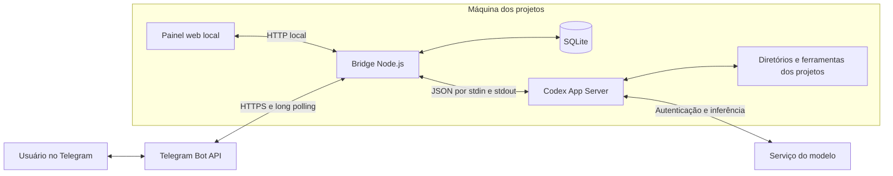
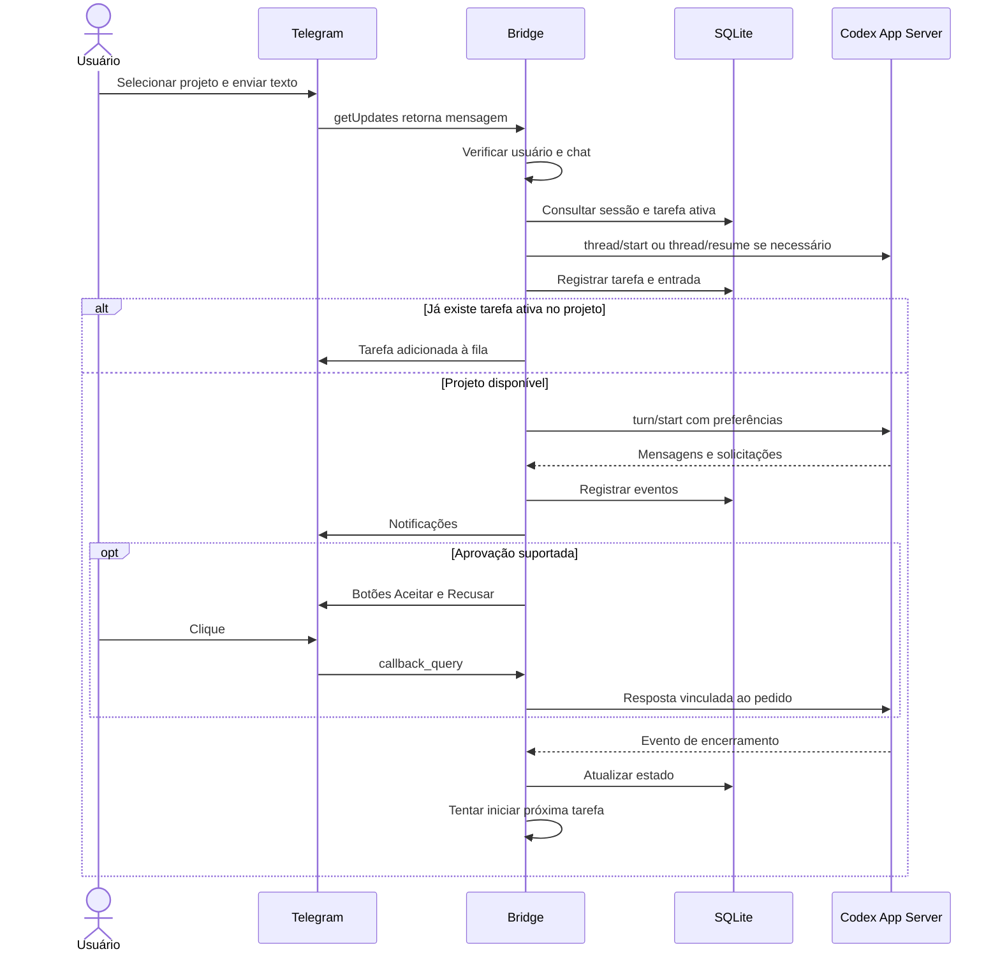
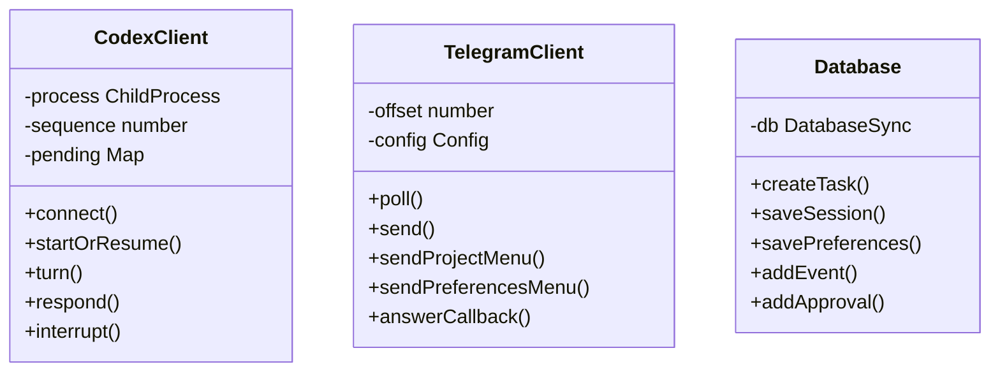
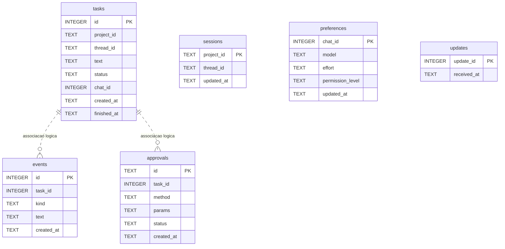

# Codex Telegram Bridge

Controle tarefas do Codex no seu computador pelo Telegram e acompanhe a execução por um painel web local. O bridge recebe instruções, seleciona o diretório de trabalho, inicia ou retoma uma conversa com o Codex App Server e registra tarefas, eventos e aprovações em SQLite.

Documentação da implementação disponível em **26/09/2026**, versão do pacote **0.1.0**. O sistema é um MVP de uso pessoal; as limitações operacionais estão descritas ao final. Os exemplos de terminal usam Bash, em Linux ou WSL. Valores como `SEU_USUARIO` são exemplos que precisam ser substituídos.

## Sumário

- [Visão geral](#visão-geral)
- [Arquitetura e execução](#arquitetura-e-execução)
- [Stack e estrutura](#stack-e-estrutura)
- [Instalação do zero](#instalação-do-zero)
- [Configuração completa](#configuração-completa)
- [Uso no Telegram](#uso-no-telegram)
- [Painel e API HTTP](#painel-e-api-http)
- [Banco de dados](#banco-de-dados)
- [Operação e reinício](#operação-e-reinício)
- [Backup e mudança de máquina](#backup-e-mudança-de-máquina)
- [Desenvolvimento e testes](#desenvolvimento-e-testes)
- [Solução de problemas](#solução-de-problemas)
- [Limitações conhecidas](#limitações-conhecidas)
- [Referências](#referências)

## Visão geral

O Telegram funciona como controle remoto. A execução dos comandos e as alterações de arquivos acontecem na máquina onde o bridge e o Codex estão instalados. Essa máquina precisa permanecer ligada, com acesso à internet e aos projetos cadastrados.

Recursos presentes no código:

- Seleção de projetos por botões inline ou `/usar <id>`.
- Menu principal com Projetos, Preferências, Status, Resumo e Ajuda.
- Preferências por chat: modelo, esforço de raciocínio e permissões, salvas em SQLite.
- Continuidade de sessão por projeto e fila básica de tarefas por projeto.
- Aprovação ou recusa de solicitações suportadas do Codex por botões.
- Resposta textual a perguntas, consulta de tarefas, resumo e solicitação de interrupção.
- Painel web com envio de instruções, projetos, tarefas, eventos, tema claro/escuro e página Hello World.
- Supervisor opcional que reinicia o processo do bridge quando ele termina.

Não é necessário instalar PostgreSQL, Redis, Docker, Express ou um servidor web separado. Para usar o Telegram não é necessário domínio, webhook nem abrir uma porta de entrada na internet: o bridge faz consultas de saída à Bot API.

## Arquitetura e execução



O bridge inicia `codex app-server --listen stdio://` quando a primeira tarefa precisa do Codex. O painel e o menu do Telegram podem abrir antes disso; `/health` não comprova que a autenticação ou uma execução do Codex funcionam.



Projeto é o diretório cadastrado; sessão é a conversa identificada por `thread_id`; tarefa é uma instrução nessa conversa; evento é um registro do que ocorreu. Há um vínculo de sessão atual por projeto, compartilhado entre web e Telegram. O bridge não espelha automaticamente uma execução aberta em outro terminal ou extensão.

## Stack e estrutura

| Camada | Implementação |
|---|---|
| Linguagem | TypeScript em modo estrito |
| Runtime | Node.js, ES Modules |
| HTTP | `node:http`, sem framework |
| Persistência | `node:sqlite`, `DatabaseSync`, WAL |
| Integração Codex | Processo filho e mensagens JSON delimitadas por linha |
| Telegram | `fetch`, `getUpdates`, mensagens e callbacks |
| Interface | HTML, CSS e JavaScript puro |
| Build | `tsc`, saída em `dist/` |
| Testes | `node:test` e `node:assert/strict` |

```text
codex-telegram-bridge/
├── README.md
├── .env.example                 # Modelo de configuração sem credenciais
├── .gitignore
├── package.json
├── package-lock.json
├── tsconfig.json
├── conversa-codex-telegram.md    # Rascunho/histórico; não é o contrato implementado
├── src/
│   ├── main.ts                  # Inicialização, comandos, callbacks e fila
│   ├── config.ts                # Leitura do ambiente e do .env
│   ├── codex-client.ts          # Transporte, turnos, permissões e eventos
│   ├── telegram.ts              # Bot API e construção dos menus
│   ├── database.ts              # Criação do banco e consultas
│   ├── http.ts                  # Rotas JSON e arquivos estáticos
│   └── types.ts                 # Tipos compartilhados
├── scripts/supervisor.mjs       # Reinício do processo filho
├── web/
│   ├── index.html
│   ├── app.js
│   ├── styles.css
│   └── hello-world.html
├── test/                       # Testes de banco, HTTP e filtro de mensagens
├── schemas/                    # Contratos gerados do Codex, incluindo v1/v2
├── dist/                       # Gerado pelo build
├── data/                       # Banco e log do supervisor, por padrão
└── node_modules/               # Dependências locais
```

Os schemas são material de referência; não são compilados pelo `tsconfig.json` atual nem validam automaticamente as mensagens em runtime.



Essas são as três classes principais. A orquestração fica nas funções de `main.ts`, que usam as três; o servidor HTTP é uma função, não uma classe adicional.

## Instalação do zero

### 1. Preparar a máquina

Use Linux para reproduzir o ambiente verificado. Em Windows, uma alternativa é Ubuntu em WSL, instalando Node, Codex e o projeto dentro do mesmo ambiente. macOS e Windows nativo não foram validados nesta documentação.

Instale Node.js com npm pelo [site oficial](https://nodejs.org/en/download). A versão observada neste projeto foi **Node.js 22.22.2**; use uma atualização compatível da linha 22 e execute os testes. O requisito decisivo é a disponibilidade de `node:sqlite` sem flags adicionais. Não use Node 18/20 para este código.

No Ubuntu/Debian, utilitários auxiliares podem ser instalados assim:

```bash
sudo apt update
sudo apt install -y git curl sqlite3
```

O executável `sqlite3` é útil para backup e diagnóstico; a aplicação usa o SQLite embutido no Node.

Verifique:

```bash
node --version
npm --version
node --input-type=module -e 'import { DatabaseSync } from "node:sqlite"; const db = new DatabaseSync(":memory:"); db.close(); console.log("SQLite disponível");'
```

### 2. Obter o código e instalar dependências

Copie a pasta do projeto ou clone o repositório que o responsável disponibilizar. Não há URL pública de clone definida nesta documentação.

```bash
git clone URL_REAL_DO_REPOSITORIO codex-telegram-bridge
cd codex-telegram-bridge
npm ci
```

Se recebeu um arquivo compactado, extraia-o e execute os dois últimos comandos na pasta que contém `package.json`. Não transporte `node_modules` de outra máquina. Não use `npm ci --omit=dev` antes de compilar: o TypeScript está em `devDependencies`.

### 3. Instalar e autenticar o Codex

Instale o CLI no mesmo ambiente e usuário que executarão o bridge:

```bash
npm install -g @openai/codex
codex --version
codex login
codex login status
codex app-server --help
command -v codex
```

Complete o login indicado pelo CLI. Em uma máquina sem navegador, consulte `codex login --help`; a versão local também oferece `codex login --device-auth`. Para autenticação por chave, o CLI local aceita `printenv OPENAI_API_KEY | codex login --with-api-key`, se essa for a modalidade escolhida.

O CLI observado foi **0.157.0**. A instalação sem versão fixa pode instalar outra versão: confirme a compatibilidade com os contratos e rode uma tarefa de aceitação. O bridge não instala o Codex como dependência do pacote e não faz login por conta própria.

Instale também as ferramentas exigidas pelos projetos de destino: Git, Java, Python, Docker ou outras, conforme cada projeto. Elas não são fornecidas pelo bridge.

### 4. Criar o bot no Telegram

1. Abra o perfil oficial [@BotFather](https://t.me/BotFather).
2. Envie `/newbot` e siga as instruções de nome e username.
3. Guarde o token entregue como uma senha.
4. Abra uma conversa privada com seu novo bot e envie `/start`.

O procedimento é descrito no [tutorial oficial do Telegram](https://core.telegram.org/bots/tutorial). Comece em conversa privada: o parser atual compara comandos literalmente e não trata todas as variantes de comandos de grupos.

### 5. Descobrir usuário e chat autorizados

Faça esta etapa **com todas as instâncias do bridge desse bot paradas**. Não execute dois consumidores de `getUpdates` com o mesmo token.

No Bash, leia o token sem gravá-lo no histórico:

```bash
read -rsp 'Token do bot: ' BRIDGE_SETUP_TOKEN
export BRIDGE_SETUP_TOKEN
node --input-type=module <<'JS'
const token = process.env.BRIDGE_SETUP_TOKEN;
const base = `https://api.telegram.org/bot${token}`;
const webhook = await (await fetch(`${base}/getWebhookInfo`)).json();
if (!webhook.ok) throw new Error(webhook.description || 'Token inválido');
if (webhook.result.url) throw new Error('Este bot tem webhook. Remova-o antes de usar long polling.');
const data = await (await fetch(`${base}/getUpdates`, {
  method: 'POST', headers: { 'content-type': 'application/json' },
  body: JSON.stringify({ timeout: 0, allowed_updates: ['message'] })
})).json();
if (!data.ok) throw new Error(data.description || 'Falha no Telegram');
for (const update of data.result) {
  if (update.message) console.log({
    userId: update.message.from?.id,
    chatId: update.message.chat.id,
    text: update.message.text
  });
}
JS
unset BRIDGE_SETUP_TOKEN
```

Escolha os IDs da mensagem que **você** enviou; não copie o ID de outro usuário. Se não houver saída, envie outra mensagem privada ao bot e repita. Use `userId` em `TELEGRAM_ALLOWED_USER_ID` e `chatId` em `TELEGRAM_ALLOWED_CHAT_ID`.

Se o bot tinha integração por webhook, remova-a somente após decidir migrá-lo. Com a variável temporária do token definida, pode usar:

```bash
node --input-type=module -e 'const r = await fetch(`https://api.telegram.org/bot${process.env.BRIDGE_SETUP_TOKEN}/deleteWebhook`, {method:"POST"}); const p = await r.json(); console.log({ok:p.ok, description:p.description});'
```

Não use `drop_pending_updates=true` sem intenção de descartar mensagens. O Telegram documenta a incompatibilidade entre webhook ativo e `getUpdates` na [Bot API](https://core.telegram.org/bots/api#getupdates).

### 6. Criar o ambiente

Na raiz do projeto, se ainda não existir `.env`:

```bash
cp .env.example .env
chmod 600 .env
```

Edite-o com seus valores. Exemplo para um projeto já existente na nova máquina:

```dotenv
TELEGRAM_BOT_TOKEN=SUBSTITUA_PELO_TOKEN_DO_BOT
TELEGRAM_ALLOWED_USER_ID=123456789
TELEGRAM_ALLOWED_CHAT_ID=123456789
PROJECTS_JSON=[{"id":"demo","name":"Meu projeto","cwd":"/home/SEU_USUARIO/projetos/meu-projeto"}]
CODEX_COMMAND=codex
CODEX_MODEL=
CODEX_MODELS_JSON=[]
CODEX_REASONING_EFFORTS_JSON=["low","medium","high"]
DB_PATH=./data/bridge.sqlite
HTTP_HOST=127.0.0.1
HTTP_PORT=8787
```

O exemplo deixa o modelo padrão do Codex ativo. Para ter opções no botão de modelos, preencha a lista conforme a seção de configuração. Crie ou copie o projeto de destino antes de continuar e confirme o caminho com `pwd` dentro dele.

### 7. Compilar, testar e iniciar

```bash
npm test
npm run dev
```

Execute na raiz. Em outro terminal:

```bash
curl --fail http://127.0.0.1:8787/health
```

Resposta esperada: `{"status":"ok"}`. Abra `http://127.0.0.1:8787` no navegador.

No Telegram, envie `/start`, escolha **Projetos**, selecione o diretório e envie uma primeira tarefa simples: `Liste os arquivos deste projeto sem alterar nada.` Confirme que houve resposta e registro da tarefa. Essa etapa valida o caminho completo; os testes automatizados não usam sua conta real do Telegram ou do Codex.

Para usar apenas a web, deixe token e IDs vazios. `PROJECTS_JSON`, Node e Codex continuam necessários para executar tarefas. Aprovações de tarefas originadas na web não possuem interface de resposta implementada.

## Configuração completa

| Variável | Obrigatória | Padrão / comportamento |
|---|---|---|
| `PROJECTS_JSON` | Sim | Array JSON não vazio com `id`, `name`, `cwd` |
| `TELEGRAM_BOT_TOKEN` | Para Telegram | Sem valor, Telegram fica desabilitado |
| `TELEGRAM_ALLOWED_USER_ID` | Para Telegram | ID numérico do único usuário autorizado |
| `TELEGRAM_ALLOWED_CHAT_ID` | Não | Se definido, restringe também o chat; recomendado em uso privado |
| `CODEX_COMMAND` | Não | `codex`; caminho do executável, sem argumentos embutidos |
| `CODEX_MODEL` | Não | Modelo usado para novas sessões sem preferência de chat |
| `CODEX_MODELS_JSON` | Não | `[]`; lista manual de IDs de modelos, com `CODEX_MODEL` acrescido se definido |
| `CODEX_REASONING_EFFORTS_JSON` | Não | `["low","medium","high"]`; também aceita `xhigh` |
| `DB_PATH` | Não | `./data/bridge.sqlite`, relativo ao diretório de execução |
| `HTTP_HOST` | Não | `127.0.0.1` |
| `HTTP_PORT` | Não | `8787` |
| `BRIDGE_RESTART_DELAY_MS` | Não | `3000`; usado somente pelo supervisor e lido do ambiente do processo |

`BRIDGE_RESTART_DELAY_MS` precisa ser exportado no shell, por exemplo `BRIDGE_RESTART_DELAY_MS=5000 npm run supervise`. O supervisor não carrega `.env`; o processo filho carrega.

O carregador `.env` é simples: uma variável por linha, JSON inteiro na mesma linha, sem `export`, interpolação `${...}`, `~` ou comentários no fim do valor. Variáveis já preenchidas no ambiente prevalecem sobre `.env`. Reinicie o processo após alterar configuração.

### Projetos

```dotenv
PROJECTS_JSON=[{"id":"api","name":"API","cwd":"/home/SEU_USUARIO/projetos/api"},{"id":"web","name":"Site","cwd":"/home/SEU_USUARIO/projetos/site"}]
```

Use IDs únicos, estáveis e curtos; eles são usados em botões e no banco. O primeiro projeto é o padrão. A configuração não verifica a existência do diretório: valide cada `cwd` e as permissões do usuário do processo.

### Modelo e nível de raciocínio

Abra o CLI `codex` e consulte `/model` para identificar opções disponíveis na sua conta. Preencha os identificadores reais, não apenas os nomes de exibição. Exemplo de formato, com valores deliberadamente fictícios:

```dotenv
CODEX_MODEL=ID_REAL_DO_MODELO
CODEX_MODELS_JSON=["ID_REAL_DO_MODELO","ID_REAL_DO_SEGUNDO_MODELO"]
CODEX_REASONING_EFFORTS_JSON=["low","medium","high","xhigh"]
```

Não copie esses IDs fictícios. A lista do bridge é manual e não consulta disponibilidade no provedor. Os níveis também não são filtrados por modelo: configure somente combinações suportadas. `xhigh` não é universal.

Em **Preferências → Escolher modelo**, o bot salva o modelo e em seguida abre os botões de raciocínio. Os valores são persistidos por chat e enviados em `turn/start` como `model` e `effort`, inclusive em conversas retomadas. Uma tarefa que já está rodando não é alterada. Tarefas na fila leem a preferência vigente quando começam, não uma cópia feita ao enfileirar.

As preferências do Telegram não são lidas diretamente para tarefas web. Contudo, web e Telegram compartilham a sessão do projeto: parâmetros omitidos podem herdar configurações da conversa. `CODEX_MODEL` é aplicado ao criar a sessão, não força uma mudança ao retomá-la.

### Permissões

| Opção | `approvalPolicy` | `sandboxPolicy` | Efeito solicitado ao Codex |
|---|---|---|---|
| Seguro (`safe`) | `untrusted` | `readOnly`, rede desabilitada | Leitura e política de aprovação restritiva |
| Projeto (`workspace`) | `on-request` | `workspaceWrite`, rede desabilitada | Escrita no diretório selecionado e temporários permitidos |
| Total (`full`) | `never` | `dangerFullAccess` | Acesso amplo, sem aprovações de comandos por essa política |

O padrão do bridge é **Projeto**. A seleção fica em `/permissoes` ou no menu Preferências. No modo Total, o Codex pode executar ações com os privilégios do usuário do sistema; não é uma opção necessária para a instalação. Políticas externas do Codex podem restringir o pedido.

## Uso no Telegram

| Comando / botão | Comportamento atual |
|---|---|
| `/start` | Abre o teclado principal |
| `/ajuda` / Ajuda | Lista os comandos |
| `/projetos` / Projetos | Exibe seleção inline com marcação do projeto atual |
| `/usar <id>` | Seleciona projeto por ID; `/usar` sozinho não abre o menu |
| `/preferencias` / Preferências | Modelo, raciocínio e permissões |
| `/permissoes` | Abre diretamente a seleção de permissão |
| `/status` / Status | Até 50 tarefas do projeto selecionado, em JSON |
| `/fila` | Mostra tarefas `queued`, `waiting_user` e `unknown` do projeto |
| `/sessoes` | Mostra o vínculo de sessão atual do projeto |
| `/nova` | Remove o vínculo da sessão; próxima tarefa sem execução ativa abre outra |
| `/retomar <taskId>` | Usa a sessão de uma tarefa do projeto selecionado |
| `/resumo [taskId]` / Resumo | Objetivo, estado e até dez eventos relevantes; não gera resumo por IA |
| `/responder <id> <resposta>` | Responde à primeira pergunta de uma solicitação suportada |
| `/cancelar <taskId>` | Solicita interrupção de tarefa `running` ou `waiting_user` |
| Texto comum | Cria uma tarefa ou entra na fila do projeto |

Use `/nova` e `/retomar` quando não houver tarefa ativa nesse projeto. `/nova` não apaga o histórico de tarefas nem encerra uma execução em andamento.

Botões de aprovação estão vinculados ao ID da solicitação. O código verifica o usuário e o chat configurados e evita responder novamente a uma aprovação já registrada como respondida. Perguntas usam `/responder`; não há um formulário completo para múltiplas perguntas.

A seleção do projeto e a referência à última tarefa ficam **em memória**. Após reiniciar, selecione o projeto novamente; para resumo de uma tarefa anterior, use seu ID explícito. Modelo, esforço e permissão ficam no SQLite.

## Painel e API HTTP

O painel atualiza consultas a cada três segundos, exibe até 20 tarefas recentes e acompanha os eventos da tarefa escolhida internamente pelo fluxo de envio. Mostra até 12 grupos de eventos. Tema é salvo no `localStorage` do navegador; não é uma preferência do Telegram.

**A API não possui autenticação nem TLS.** Mantenha `HTTP_HOST=127.0.0.1`; quem acessa `POST /commands` pode enviar tarefas. Para acesso remoto, use um túnel SSH para o loopback, em vez de expor essa porta diretamente:

```bash
ssh -N -L 8787:127.0.0.1:8787 SEU_USUARIO@MAQUINA_DO_BRIDGE
```

| Método | Rota | Resposta |
|---|---|---|
| GET | `/` | Painel HTML |
| GET | `/hello-world` | Página de demonstração |
| GET | `/app.js`, `/styles.css` | Recursos estáticos |
| GET | `/health` | `{"status":"ok"}`; apenas disponibilidade HTTP |
| GET | `/projects` | `{"projects":[...]}`, incluindo caminhos locais |
| GET | `/status` | `{"status":"ok","tasks":[...]}` |
| GET | `/events` | Últimos 100 eventos, ordem decrescente de ID |
| GET | `/events?taskId=1` | Eventos dessa tarefa, ordem crescente, sem limite explícito |
| POST | `/commands` | Cria tarefa; `202` com `{"accepted":true,"taskId":1}` |

Exemplo que **executa uma nova tarefa** no projeto `demo`:

```bash
curl --fail-with-body http://127.0.0.1:8787/commands \
  -H 'Content-Type: application/json' \
  -d '{"projectId":"demo","text":"Liste os arquivos sem alterá-los."}'
```

`projectId` omitido usa o primeiro projeto; um ID inexistente é rejeitado. `text` precisa ser não vazio. `202` não significa tarefa concluída: consulte `/status` e `/events`.

Erros principais: `400` para JSON inválido, texto vazio (`text_required`), erro no handler ou corpo acima do limite implementado de 100.000 caracteres; `404` para rota inexistente; `503` se não houver handler de comandos. O parser não é um validador completo de schema.

## Banco de dados

O banco é criado automaticamente no primeiro início. Usa WAL; os arquivos `bridge.sqlite-wal` e `bridge.sqlite-shm` são auxiliares, não lixo que deve ser removido durante a execução.

No modelo ER, as tabelas são representadas no plural, com letras minúsculas. Quando o nome for composto, utiliza-se `_` para separar os termos. As colunas também seguem o padrão `snake_case`.



As linhas representam associações lógicas; **não existem constraints `FOREIGN KEY` declaradas**. `events.task_id` e `approvals.task_id` aceitam `NULL`, permitindo registros sem tarefa. Projetos vêm do JSON de configuração: não existe tabela `projects`.

| Tabela | Dados e restrições efetivas |
|---|---|
| `updates` | `update_id INTEGER PRIMARY KEY`; `received_at TEXT NOT NULL DEFAULT CURRENT_TIMESTAMP`; deduplicação de mensagens |
| `sessions` | `project_id TEXT PRIMARY KEY`; `thread_id TEXT NOT NULL`; `updated_at TEXT NOT NULL DEFAULT CURRENT_TIMESTAMP`; um vínculo por projeto |
| `tasks` | `id INTEGER PRIMARY KEY AUTOINCREMENT`; `project_id`, `thread_id`, `text`, `status` são `TEXT NOT NULL`; `chat_id INTEGER` e `finished_at TEXT` aceitam `NULL`; `created_at TEXT NOT NULL DEFAULT CURRENT_TIMESTAMP` |
| `events` | `id INTEGER PRIMARY KEY AUTOINCREMENT`; `task_id INTEGER` opcional; `kind`, `text` são `TEXT NOT NULL`; `created_at TEXT NOT NULL DEFAULT CURRENT_TIMESTAMP` |
| `approvals` | `id TEXT PRIMARY KEY`; `task_id INTEGER` opcional; `method`, `params` são `TEXT NOT NULL`; `params` contém JSON serializado; `status TEXT NOT NULL DEFAULT 'pending'`; `created_at TEXT NOT NULL DEFAULT CURRENT_TIMESTAMP` |
| `preferences` | `chat_id INTEGER PRIMARY KEY`; `model`, `effort`, `permission_level` são `TEXT` opcionais; `updated_at TEXT NOT NULL DEFAULT CURRENT_TIMESTAMP` |

Não há constraints `CHECK` para estados. O código cria tabelas com `IF NOT EXISTS` e tenta acrescentar `chat_id` e `permission_level` a bancos anteriores; não existe framework de migrations versionadas.

Estados de tarefa: `queued` (fila), `running` (execução), `waiting_user` (aguardando resposta), `completed`, `failed`, `interrupted` e `unknown` (resultado indeterminado). Na inicialização, tarefas em fila, execução ou espera são marcadas `unknown` e não são reexecutadas automaticamente.

## Operação e reinício

| Comando | Uso |
|---|---|
| `./start.sh` | Compila, inicia, registra logs em `data/start.log` e trata `Ctrl+C` |
| `npm ci` | Instala versões do lockfile |
| `npm run build` | Compila fontes e testes |
| `npm start` | Executa `dist/src/main.js`; não compila |
| `npm run dev` | Compila e inicia; não possui watch/hot reload |
| `npm run supervise` | Compila e inicia o supervisor |
| `npm test` | Compila e roda testes |

### Reiniciar manualmente

1. Espere tarefas terminarem, quando possível: reiniciar não é uma pausa recuperável.
2. No terminal da instância atual, pressione `Ctrl+C` e aguarde a saída. O polling pode aguardar a requisição de até 25 segundos; falhas de rede podem atrasar mais.
3. Confirme que a porta ficou livre. Em Linux: `ss -ltnp 'sport = :8787'`.
4. Na raiz, execute `./start.sh`.
5. Confira `/health` e envie `/start` no Telegram para obter o teclado atualizado.

O script precisa estar executável (`chmod +x start.sh`, já aplicado no repositório). Ele mostra os logs no terminal e também os acrescenta em `data/start.log`. `Ctrl+C`, `SIGTERM` e `SIGHUP` são encaminhados à aplicação; se ela não encerrar no prazo padrão de 30 segundos, o processo é finalizado. Para mudar o prazo ou o arquivo de log:

```bash
BRIDGE_SHUTDOWN_TIMEOUT=45 BRIDGE_LOG_FILE=/tmp/codex-bridge.log ./start.sh
```

Não abra uma segunda instância para tentar reiniciar a primeira. Além de `EADDRINUSE`, a inicialização já abre o banco e marca tarefas ativas como `unknown` antes de detectar o conflito de porta.

Se não souber quem iniciou o processo, identifique o PID, o diretório (`readlink /proc/PID/cwd`) e o comando antes de enviar `kill -TERM PID`. Se houver supervisor, pare o supervisor; encerrar apenas o filho faz ele renascer. Não use comandos que matem todos os processos Node da máquina.

### Supervisor opcional

```bash
npm run supervise
```

Reinicia o filho após três segundos quando ele termina, inclusive em saída normal. `Ctrl+C` no supervisor solicita parada do filho. Registra início e saída em `data/supervisor.log`; stdout/stderr do bridge continuam no terminal. O log não tem rotação automática.

O supervisor não instala serviço do sistema, não mantém a máquina ligada, não recompila a cada reinício e não garante a continuidade do App Server ou das tarefas. Para ativação após boot, configure separadamente um gerenciador de serviços com diretório de trabalho na raiz, usuário que fez login no Codex e `PATH` correto. Não execute supervisor e outra instância manual com o mesmo banco/bot/porta.

## Backup e mudança de máquina

Há três conjuntos diferentes: código/configuração do bridge, banco de histórico e diretórios/estado do Codex. Copiar somente SQLite não transfere os arquivos dos projetos nem garante que os `thread_id` possam ser retomados no novo computador.

Para um backup consistente do banco em execução, use o mecanismo de backup do SQLite, substituindo o caminho se `DB_PATH` for diferente:

```bash
mkdir -p backups
sqlite3 data/bridge.sqlite ".backup 'backups/bridge-2026-09-26.sqlite'"
sqlite3 backups/bridge-2026-09-26.sqlite 'PRAGMA integrity_check;'
```

Use um nome novo a cada backup. O resultado da verificação deve ser `ok`. Proteja esses arquivos: contêm instruções, eventos e caminhos locais. Guarde `.env` separadamente de forma segura. Não copie apenas o arquivo `.sqlite` de um banco ativo ignorando o WAL.

Para mudar de máquina:

1. Pare a instância antiga, incluindo supervisor. Evite dois consumidores do mesmo bot.
2. Faça e verifique o backup; transfira código, backup e projetos por um canal seguro.
3. Instale dependências e autentique o Codex na máquina nova seguindo este README.
4. Recrie `.env`, corrigindo `cwd`, executável e caminhos do banco.
5. Para instalação nova, deixe a aplicação criar um banco vazio. Para manter histórico, coloque o backup em um **novo caminho** e configure `DB_PATH` para ele, sem sobrescrever um banco ativo.
6. Inicie e selecione cada projeto. Se as sessões antigas não existirem no novo Codex, use `/nova` antes de enviar a próxima tarefa.
7. Execute uma tarefa de leitura e verifique o histórico e as notificações.

Preferências por chat permanecem no backup. Referências de sessão dependem do estado do Codex, armazenado fora do SQLite do bridge. Não distribua credenciais do Codex junto com o repositório.

## Desenvolvimento e testes

```bash
npm ci
npm test
```

Os testes atuais cobrem filtro de mensagens visíveis do agente, deduplicação de update, persistência de tarefa/aprovação e rotas HTTP com envio de comando simulado. O teste HTTP abre uma porta local temporária, e os testes de banco usam diretórios temporários.

Eles não comprovam integração real com Telegram, modelos, callbacks de preferências, interrupção ou concorrência. Para validar uma entrega funcional, execute também o roteiro de aceitação da instalação, selecione modelo e esforço válidos, reinicie e confira a preferência salva.

Não edite `dist/` diretamente: é sobrescrito no build. Não edite schemas gerados para corrigir o bridge; a adaptação do protocolo fica em `src/codex-client.ts`. Não versione `.env`, banco ou dependências. O `.gitignore` já contempla esses caminhos.

## Solução de problemas

### `thread-store conflict: ... already has an active writer`

Esse erro ocorre quando uma sessão persistida do Codex ainda está sendo usada
por outro processo ou ficou bloqueada após uma interrupção. O bridge trata esse
caso automaticamente: preserva a thread antiga, inicia uma nova thread no mesmo
projeto, atualiza a sessão ativa no SQLite e registra a recuperação no log e na
tarefa. Nenhum histórico é apagado.

Para evitar duas instâncias do bridge, inicie-o pela raiz com:

```bash
./start.sh
```

O script usa `data/bridge.lock`; ao pressionar `Ctrl+C`, ele encerra o processo
filho e libera o lock. Se uma tarefa específica precisar ser abandonada
manualmente, `/nova` também remove somente a sessão ativa do projeto e mantém
as tarefas e eventos registrados.

### `EADDRINUSE` na porta 8787

Há outro processo ocupando a porta configurada. Encerre a instância anterior e
inicie novamente com `./start.sh`. O script impede duplicidade quando as duas
instâncias são iniciadas por ele.

| Sintoma | Verificação e ação |
|---|---|
| `PROJECTS_JSON` ausente | Crie `.env` na raiz e execute a aplicação a partir dessa pasta |
| Erro de JSON na inicialização | Use aspas duplas internas e JSON em uma linha; remova comentários no fim dos valores |
| `node:sqlite` não disponível | Confira o Node usado pelo terminal/serviço; use a versão compatível indicada acima |
| `codex` não encontrado / `ENOENT` | Confira `command -v codex`; configure caminho absoluto em `CODEX_COMMAND` |
| Login funciona no terminal mas falha no serviço | Verifique usuário, ambiente e armazenamento de autenticação do processo |
| `EADDRINUSE` em 8787 | Identifique a instância existente; pare-a antes de iniciar outra |
| Telegram não responde | Confira token, usuário, chat, acesso HTTPS, webhook e se existe outro polling ativo |
| `Acesso não autorizado` | Refaça a identificação de `from.id` e `chat.id`; username não substitui ID numérico |
| Botão Preferências não aparece | Recompile, reinicie a instância correta e envie `/start`; teste `/preferencias` diretamente |
| Menu de modelos vazio | Preencha `CODEX_MODELS_JSON` ou `CODEX_MODEL` e reinicie |
| Modelo ou esforço rejeitado | Confirme IDs e compatibilidade na conta; lista local não valida acesso no provedor |
| Configuração antiga continua ativa | Variáveis exportadas prevalecem; `npm start` não recompila; confira processo e diretório |
| `BUTTON_DATA_INVALID` | IDs de projeto/modelo muito longos podem exceder 64 bytes de `callback_data`; use IDs curtos válidos |
| Painel conectado, tarefa travada | `/health` testa apenas HTTP; confira logs, autenticação, aprovação pendente e estado do App Server |
| Tarefa web aguardando aprovação | Não há resposta pelo painel; use Telegram para trabalhos que dependam desse fluxo |
| Tarefa `unknown` após reinício | Não foi retomada automaticamente; examine eventos e envie nova instrução conscientemente |
| `/resumo` sem tarefa após reinício | Informe `/resumo <taskId>`; a última tarefa do chat fica em memória |
| Falha ao retomar em outra máquina | O banco contém ID de uma sessão não disponível; selecione o projeto e use `/nova` sem tarefa ativa |
| `listen EPERM` no teste | O ambiente bloqueia bind local; execute os testes em ambiente autorizado a abrir porta loopback |
| Mudança de CSS não aparece | Atualize o navegador sem cache; alterações em TypeScript requerem build e reinício |

## Limitações conhecidas

- A API HTTP é local e sem autenticação; não foi projetada como serviço público multiusuário.
- O usuário autorizado é único por instância. Projetos compartilham uma sessão entre canais; isolamento por chat não é completo.
- A fila não tem bloqueio transacional contra submissões simultâneas. Falhas de início ou recusas podem exigir intervenção para avançar.
- O adaptador trata `turn/completed` como sucesso sem interpretar todos os estados internos do turno. Interrupção depende da compatibilidade do protocolo; o fluxo atual não mantém o `turnId` para enviá-lo sempre.
- Não há timeout/reconexão robusta para cada requisição ao App Server. O shutdown do bridge não gerencia explicitamente todo o ciclo de vida do processo Codex filho.
- O polling repete após erro, mas não exibe todos os erros em log. O offset fica em memória; a deduplicação persistida cobre mensagens, não todos os callbacks.
- Aprovações antigas não são todas invalidadas no reinício. Solicitações não suportadas exigem intervenção; `/responder` usa apenas a primeira pergunta.
- Comandos desconhecidos podem virar instruções para o Codex. `/usar` sem ID e comandos com sufixo de bot em grupos não têm tratamento completo.
- Modelos e esforços são listas manuais. Preferências não têm botão de restauração do padrão e são lidas ao iniciar cada tarefa.
- O painel não oferece gerenciamento completo de sessões, aprovações, cancelamento ou preferências do Codex. Recarrega o seletor de projetos nas consultas periódicas; a seleção visual pode voltar à primeira opção.
- O histórico não possui retenção automática. O tamanho do banco e dos logs deve ser acompanhado.

Esses pontos são limites observáveis da implementação, não recursos já resolvidos pelo supervisor ou pela existência dos schemas.

## Referências

- [Configuração efetiva](src/config.ts) e [exemplo de ambiente](.env.example).
- [Orquestração e comandos](src/main.ts), [cliente Telegram](src/telegram.ts) e [cliente Codex](src/codex-client.ts).
- [Banco de dados](src/database.ts), [API HTTP](src/http.ts) e [supervisor](scripts/supervisor.mjs).
- [Node.js — instalação](https://nodejs.org/en/download).
- [Telegram — criação do bot](https://core.telegram.org/bots/tutorial) e [Bot API](https://core.telegram.org/bots/api).
- Para opções exatas do Codex instalado: `codex --help`, `codex login --help` e `codex app-server --help`.

Este README descreve o código disponível; o arquivo de conversa contém ideias anteriores e não substitui a implementação como fonte de verdade.
