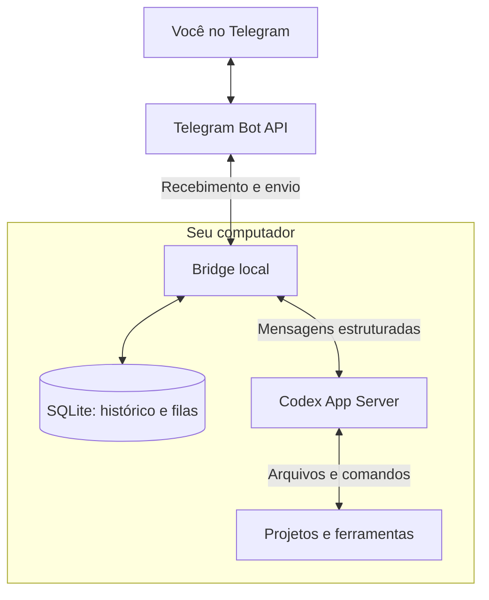
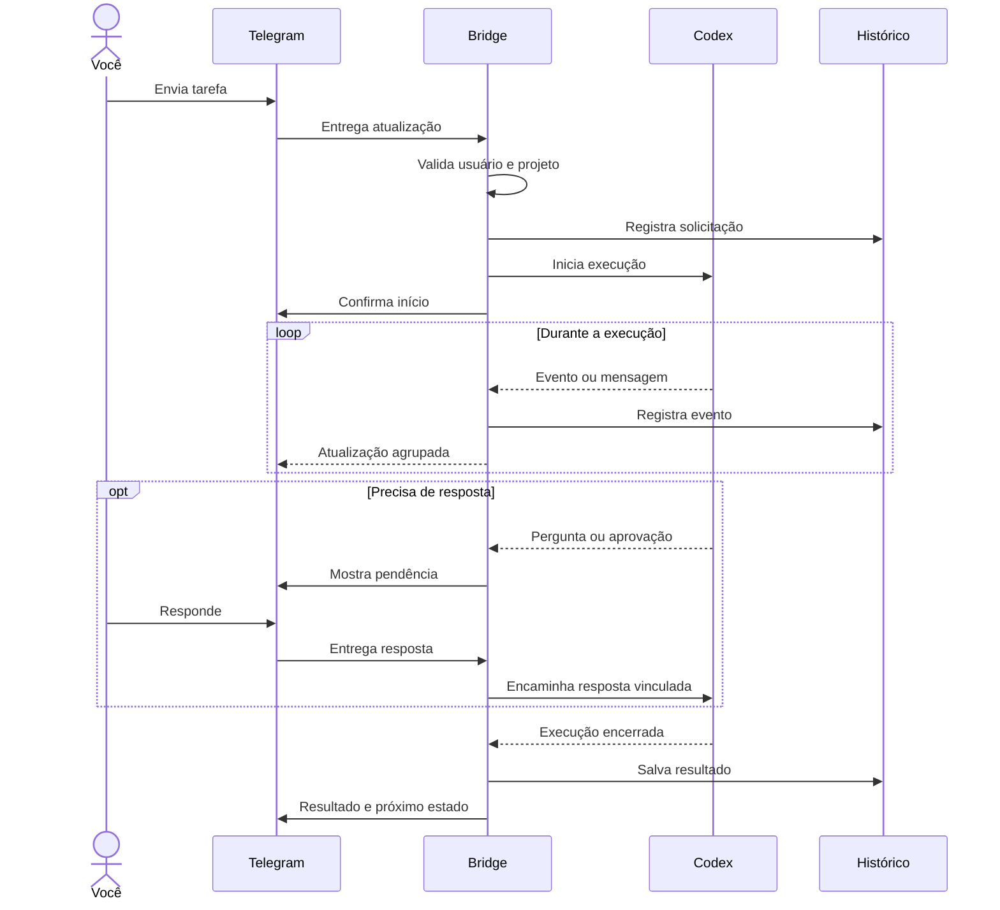
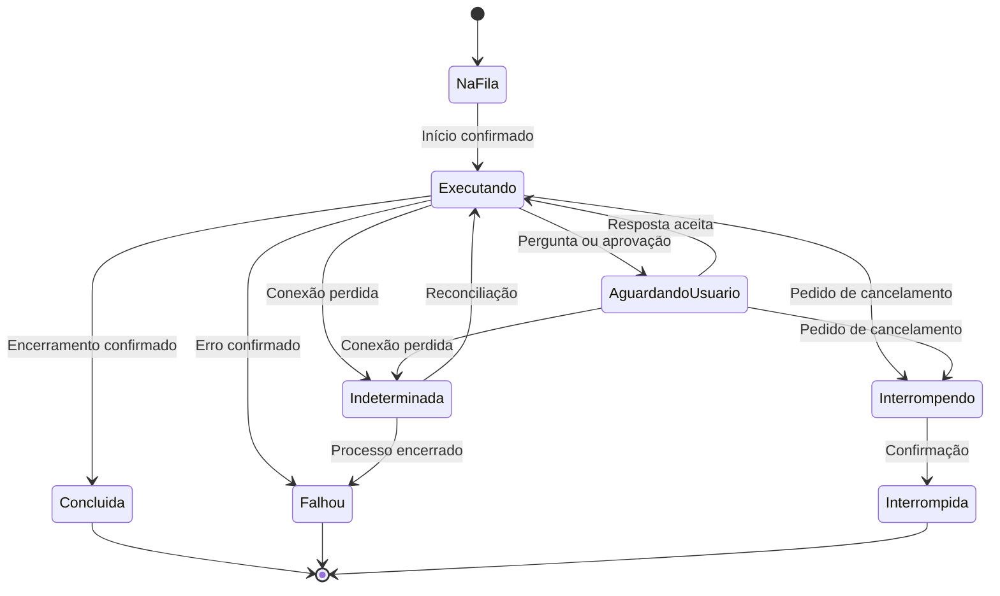

# Conversa — Codex Telegram Bridge

Data: 25/09/2026.

Exportação das mensagens desta conversa sobre a integração entre Codex e Telegram. Diagramas preservados em Mermaid; referências convertidas em links Markdown.

## Usuário — Pedido inicial

Bom, eu estou com um pequeno problema sobre desenvolvimento com inteligência artificial no meu computador atualmente, porque eu tenho vários projetos, várias demandas e às vezes eu não consigo, às vezes eu não consigo acompanhar as coisas que são feitas no meu computador, porque às vezes eu faço um planejamento com alguns modelos de inteligência artificial que têm mais bilhões de parâmetros, né, como o Astra da OpenAI, que eu utilizo, porque eu sou assinante dos serviços da OpenAI, tenho o ChatGPT Pro. Então eu tenho ali essa questão da utilização da inteligência artificial para codificação no meu dia a dia. Porém, muitas das vezes eu faço todo o planejamento das minhas tarefas, coloco um modelo um pouco mais fraco para fazer a execução das tarefas, já que o planejamento foi realizado por um modelo melhor. E ali eu geralmente dou um comando e eu demoro cerca, às vezes, de 5, 10 minutos para a IA terminar a task que eu dei, né, fazendo tudo que ela tem que fazer. Só que às vezes é muito ruim, porque às vezes eu não consigo acompanhar essas coisas, porque eu não fico na frente. Muitas vezes eu tô com a minha namorada e aí eu fico conversando no celular e aí, tipo, eu fico meio perdido. Na hora que eu volto para essa parte, eu acabo não tendo mais a imersão do que realmente foi feito ali, quais foram as verificações, porque além dos testes e tudo mais que é feito, geralmente o codex vai me fornecendo ali a saída: Olha, fiz os testes aqui, está em 80% tudo e tal, e agora eu vou desenvolver isso aqui. E assim ela vai continuando, continuando. E aí entrou uma dúvida e uma ideia ao mesmo tempo, tipo: será que é possível desenvolver um... eu quero desenvolver uma API, um microserviço, na qual ela vai ter pouquíssimos endpoints, né? Mas a premissa é que ela tem um endpoint de entrada e um endpoint de saída. O endpoint de entrada seria para eu capturar os dados que são enviados por esse Harness do codex, que são a saída do codex, e de entrada também, para quando eu quiser dar um comando para ela, que eu ver que ela está em modo de espera, eu conseguir dar um comando. Só que aí é que entra a questão. Essa API, ela seria um microserviço desenvolvido e ela teria uma integração com um bot do Telegram. Então o Telegram seria a chave principal desse projeto. Então eu teria o Telegram, na qual eu recebo e envio mensagens para uma API e essa API ficaria ali disponível, rodando no meu computador junto com o meu codex, e o codex ficaria sempre olhando para essa porta. Tipo assim, quando ela receber alguma coisa dali, ela faz, e quando ela precisar ir falando o que ela está fazendo durante a task dela ali, ela vai jogando, e eu queria estar trabalhando com esse tipo de mensagem. A gente consegue desenvolver algum microserviço assim? Eu quero que você faça um planejamento, faça um plano bem grande para ver se a gente consegue desenvolver isso aí. Faça... não precisa caprichar muito em documentação, faça apenas um rascunho do que eu quero, porque eu vou pegar essa ideia e eu vou jogar dentro do codex e o codex vai desenvolver isso pra mim, entendeu? Apenas faça apontamento. Uma coisa que eu gosto muito, que me ajuda muito, é diagrama, documento em diagrama, essas coisas. Então diagrama, utilize Mermaid Markdown, é muito bom para fazer isso.

## Assistente — Atualização inicial

Vou verificar as interfaces do Codex e do Telegram para montar um rascunho viável, com diagramas Mermaid, fluxo das mensagens e etapas de implementação.

## Assistente — Atualização da pesquisa

A documentação oficial da OpenAI confirma uma interface adequada: o **Codex App Server**, que permite enviar comandos, receber eventos e tratar aprovações. O ponto principal do plano será fazer o microserviço controlar essa sessão. Espelhar uma sessão já aberta no terminal ou na extensão precisa de uma validação separada.

Para o Telegram, vou propor recebimento por *long polling*: o serviço no seu computador busca as mensagens, sem precisar expor uma porta à internet.

## Assistente — Plano completo

**Sim, Anderson, conseguimos desenvolver isso.** Sua ideia é um **controle remoto do Codex pelo Telegram**, com histórico por projeto, acompanhamento da execução e envio de novos comandos pelo celular.

O componente mais importante será uma ponte local entre o Telegram e o Codex. Ela manterá o contexto das conversas e registrará o que aconteceu para você conseguir retomar o trabalho sem precisar reler toda a saída do terminal.

Abaixo está o rascunho para você passar ao Codex.

**1. Ideia do projeto**

Nome provisório: **Codex Telegram Bridge**.

Desenvolver um serviço que rode no computador onde estão os projetos e permita:

- Selecionar um projeto pelo Telegram.
- Iniciar uma tarefa ou continuar uma conversa.
- Receber atualizações durante a execução.
- Consultar o que foi alterado e quais verificações foram realizadas.
- Responder a perguntas e solicitações de aprovação.
- Interromper uma execução.
- Consultar um resumo do trabalho ao voltar para o computador.
- Usar perfis configuráveis para planejamento, execução e revisão.

O computador precisa permanecer ligado, conectado à internet e com o serviço em execução.

**2. Como conectar ao Codex**

A documentação oficial oferece o **Codex App Server** para integrações com conversas, eventos e aprovações. O serviço pode iniciá-lo como processo local e trocar mensagens estruturadas por `stdin/stdout`. Isso evita depender de leitura visual do terminal. [Fonte: Codex App Server](https://developers.openai.com/codex/app-server/)

A arquitetura proposta é:



**Um ajuste na sua ideia:** o Codex não precisa ficar consultando uma porta da sua API. O serviço recebe a mensagem do Telegram e a encaminha ao processo do Codex; depois escuta os eventos que esse processo devolve.

**Limite inicial do projeto:** controlar sessões iniciadas ou retomadas pela própria ponte. Não assumir que ela conseguirá acompanhar automaticamente qualquer execução já aberta na extensão ou em outro terminal. Essa integração deve ser validada separadamente.

**3. Recebimento das mensagens sem abrir portas**

Para o primeiro MVP, usar **long polling**:

- O serviço consulta o Telegram e aguarda mensagens.
- Quando você envia algo, o Telegram devolve essa atualização.
- O serviço processa a mensagem e envia a resposta.

O Telegram oferece `getUpdates` para esse recebimento e `sendMessage` para o envio. Webhook é uma alternativa, mas não é necessário nesta arquitetura. [Fonte: Telegram Bot API](https://core.telegram.org/bots/api)

Isso permite começar sem domínio, hospedagem, IP público ou redirecionamento de portas no roteador.

A API HTTP pode existir apenas localmente, para consultas e futuras integrações.

**4. Organização interna**

Um único serviço, dividido em módulos:

| Módulo | Responsabilidade |
|---|---|
| Integração Telegram | Receber mensagens, comandos e cliques nos botões |
| Orquestrador | Identificar projeto, sessão e ação solicitada |
| Adaptador Codex | Gerenciar processo, protocolo e eventos |
| Fila de tarefas | Controlar execução e evitar conflitos |
| Histórico | Persistir tarefas, mensagens, eventos e resultados |
| Notificações | Agrupar atualizações e enviar mensagens legíveis |
| API local | Disponibilizar comandos, consultas e monitoramento |

**Stack proposta:** Node.js com TypeScript, SQLite e uma API HTTP pequena.

É uma escolha de implementação para facilitar processos e eventos. Java com Spring Boot também é viável, mas não há necessidade de dois serviços ou de um banco separado no MVP.

**5. Diferenciar projeto, sessão e tarefa**

Essa separação é essencial para não misturar suas demandas.

| Conceito | Significado | Exemplo |
|---|---|---|
| Projeto | Diretório cadastrado no computador | `PCM++` |
| Sessão | Conversa com contexto contínuo | “Reformular autenticação” |
| Tarefa | Uma solicitação dentro da sessão | “Implemente a validação” |
| Evento | Algo ocorrido durante a tarefa | “Comando de teste finalizado” |
| Pendência | Resposta ou aprovação necessária | “Autorizar este comando?” |

Um projeto pode ter várias sessões. Cada sessão pode receber várias tarefas ao longo do tempo.

**Trocar o projeto selecionado no Telegram não deve interromper tarefas de outros projetos.**

Toda notificação deve identificar sua origem:

```text
[PCM++ · Sessão 12 · Tarefa 48]

Executando verificações.
Última atividade: teste de autenticação.
```

**6. Fluxo de uma tarefa**



O protocolo documenta operações como `thread/start`, `thread/resume`, `turn/start`, `turn/interrupt` e `turn/steer`. O adaptador deverá validar os métodos e formatos disponíveis na versão instalada. [Fonte: Codex App Server](https://developers.openai.com/codex/app-server/)

**7. Comandos no Telegram**

Sugestão de interface:

| Comando | Comportamento |
|---|---|
| `/projetos` | Lista projetos cadastrados |
| `/usar pcm` | Seleciona o projeto PCM++ |
| `/nova` | Abre uma sessão no projeto selecionado |
| `/sessoes` | Lista sessões do projeto |
| `/retomar 12` | Seleciona uma sessão existente |
| `/status` | Mostra execução atual e pendências |
| `/resumo` | Mostra objetivo, avanços e próximos passos |
| `/historico` | Lista tarefas recentes |
| `/fila` | Mostra tarefas aguardando execução |
| `/cancelar 48` | Solicita interrupção da tarefa identificada |
| `/perfil executor` | Seleciona o perfil para próximas tarefas |
| `/ajuda` | Mostra instruções |

Texto comum vira uma tarefa **quando houver projeto e sessão definidos**.

Exemplo:

```text
Você:
/usar pcm

Bot:
Projeto selecionado: PCM++
Sessão atual: Autenticação
Estado: disponível

Você:
Execute a etapa 2 do plano e rode as verificações previstas.

Bot:
Tarefa 48 iniciada.
Projeto: PCM++
Perfil: executor
```

Usar botões para ações frequentes: **Status**, **Resumo**, **Ver pendência** e **Interromper**.

**8. O que acontece quando você envia uma mensagem durante a execução**

Definir comportamento explícito:

| Situação | Comportamento proposto |
|---|---|
| Sessão disponível | Iniciar uma tarefa |
| Sessão executando | Oferecer “Enfileirar” ou “Orientar tarefa atual” |
| Aguardando pergunta | Vincular resposta à pergunta correta |
| Aguardando aprovação | Exigir decisão vinculada à solicitação |
| Sessão desconectada | Informar indisponibilidade e preservar a mensagem |
| Várias pendências | Pedir seleção por botão ou resposta à mensagem |

No MVP, implementar primeiro **enfileirar**. Orientar uma tarefa em andamento pode entrar depois.

Uma mensagem como “sim” não deve autorizar algo por aproximação: precisa estar vinculada à pendência correspondente.

**9. Estados da execução**



**Silêncio não significa conclusão.** A aplicação deve considerar o estado confirmado pelo protocolo.

Da mesma forma, “pedido de interrupção enviado” e “execução interrompida” são estados diferentes. Interromper também não desfaz alterações já realizadas.

**10. Quais atualizações receber**

O objetivo é manter você informado sem transformar o Telegram em um terminal cheio de mensagens.

Proposta:

- Enviar início imediatamente.
- Agrupar mensagens de progresso em pequenos intervalos.
- Mostrar comandos relevantes e seus resultados.
- Enviar perguntas e aprovações imediatamente.
- Enviar conclusão ou falha imediatamente.
- Manter detalhes adicionais no histórico.

Exemplo ilustrativo:

```text
[PCM++ · Tarefa 48]

Etapa atual: verificação

• Alterações na autenticação registradas.
• Comando de testes finalizado com código 0.
• Revisão do resultado em andamento.
```

Regras importantes:

- Não inventar percentual de conclusão.
- “3 de 5 etapas concluídas” só quando existir um plano acompanhado.
- “Testes passaram” deve ter evidência correspondente.
- Diferenciar o que o agente relatou do que um comando efetivamente confirmou.
- Quando houver pouca atividade, mostrar “sem novos eventos há X minutos”, sem concluir que travou.

Encaminhar mensagens e eventos disponibilizados pela interface; não prometer reprodução exata de toda a interface visual nem acesso a raciocínio interno.

Mensagens longas devem ser divididas ou enviadas como arquivo. O Telegram limita o texto de `sendMessage` a 4.096 caracteres após o processamento das entidades. [Fonte: Telegram Bot API](https://core.telegram.org/bots/api)

**11. O recurso mais importante para o seu problema: retomada de contexto**

O comando `/resumo` deve responder:

```text
PROJETO: PCM++
SESSÃO: Autenticação

OBJETIVO
Implementar a etapa 2 do plano.

O QUE FOI FEITO
Alterações registradas nesta sessão.

VERIFICAÇÕES
Comandos executados e resultados disponíveis.

PENDÊNCIAS
O que ainda precisa de implementação ou validação.

ÚLTIMA DECISÃO
A orientação mais recente enviada por você.

PRÓXIMO PASSO
A etapa prevista no plano.

ESTADO
Disponível para novo comando.
```

Persistir também a última tarefa consultada por você, permitindo posteriormente:

```text
/resumo desde_ultima_consulta
```

Começar com um resumo estruturado a partir dos dados registrados. Resumos adicionais gerados por modelo devem ser opcionais e identificados como tal, pois representam outra execução.

**12. Planejamento com um modelo e execução com outro**

Criar perfis configuráveis:

| Perfil | Finalidade |
|---|---|
| Planejador | Elaborar etapas e critérios de conclusão |
| Executor | Implementar uma etapa aprovada |
| Revisor | Avaliar alterações e verificações |

Cada perfil guarda o identificador de modelo disponível na instalação e as configurações suportadas.

**Não fixar no código que o nome exibido “Astra” corresponde a um identificador específico.** Validar os modelos efetivamente disponíveis na conta e na interface utilizada.

Se o planejamento ocorrer em outra conversa, importar o plano explicitamente. O executor deve receber:

- Objetivo.
- Escopo.
- Restrições.
- Etapas.
- Critérios de conclusão.
- Verificações esperadas.
- Decisões já tomadas.

A troca de modelo não substitui essa transferência de contexto.

O Codex documenta autenticação com ChatGPT e com chave de API. A implementação deve validar a modalidade disponível; usar uma chave de API envolve cobrança separada, enquanto o acesso por ChatGPT segue os limites do plano. [Fonte: Autenticação do Codex](https://developers.openai.com/codex/auth)

**13. API local pequena**

Os endpoints abaixo são **propostos para a sua aplicação**, não endpoints HTTP nativos do Codex:

| Método e rota | Finalidade |
|---|---|
| `POST /commands` | Receber tarefa, cancelamento ou resposta a pendência |
| `GET /events?after=...` | Consultar eventos após um cursor |
| `GET /status` | Consultar disponibilidade, tarefas e pendências |
| `GET /health` | Verificar saúde do serviço |

Exemplo de entrada:

```json
{
  "requestId": "identificador-unico",
  "projectId": "pcm",
  "sessionId": "sessao-12",
  "action": "message",
  "text": "Execute a etapa 2 do plano."
}
```

Retornar rapidamente um identificador e o estado de aceitação. A requisição HTTP não precisa ficar aberta durante os dez minutos de execução.

Não é necessário criar um endpoint para o Codex fazer `POST` a cada atualização: o adaptador já recebe os eventos e os encaminha internamente.

**14. Persistência e recuperação**

Usar SQLite para armazenar:

- Projetos e diretórios autorizados.
- Sessões e identificadores correspondentes do Codex.
- Tarefas e estados.
- Eventos em ordem.
- Perguntas e aprovações pendentes.
- Atualizações do Telegram já processadas.
- Notificações aguardando envio.

Regras de confiabilidade:

- Uma mensagem recebida duas vezes não pode executar a tarefa duas vezes.
- Persistir o recebimento antes de avançar a confirmação ao Telegram.
- Falha ao enviar uma notificação não pode reiniciar a tarefa.
- Após reinício, reconciliar tarefas em andamento antes de reenviar comandos.
- Não reexecutar automaticamente uma tarefa cujo resultado ficou desconhecido.
- Aprovações antigas não podem autorizar solicitações novas.

No MVP, permitir **uma execução por diretório de trabalho**. Projetos diferentes podem trabalhar em paralelo posteriormente. Execuções simultâneas no mesmo repositório exigem isolamento e coordenação.

**15. Controles de acesso essenciais**

Como o bot poderá acionar alterações no computador:

- Aceitar somente seu ID numérico de usuário e chats autorizados.
- Começar com conversa privada com o bot.
- Cadastrar diretórios de projetos localmente.
- Não aceitar caminhos arbitrários recebidos pelo Telegram.
- Manter token do bot fora do código e dos logs.
- Manter a API em `127.0.0.1`, com autenticação.
- Preservar as permissões e políticas de aprovação do Codex.
- Mostrar a ação concreta antes de encaminhar uma aprovação.
- Remover segredos conhecidos dos trechos enviados ao Telegram.

Conteúdo de arquivos e saídas de ferramentas deve ser tratado como conteúdo, sem ganhar autoridade para configurar a ponte ou autorizar ações.

**16. Etapas de desenvolvimento**

| Etapa | Entrega | Critério de conclusão |
|---|---|---|
| 0 — Validar integração | Teste local com App Server | Enviar tarefa, receber eventos e continuar conversa |
| 1 — Telegram básico | Receber e responder mensagens | Somente usuário autorizado consegue interagir |
| 2 — Fluxo completo | Telegram → Codex → Telegram | Tarefa simples executada em projeto de teste |
| 3 — Continuidade | Sessões, histórico e `/resumo` | Reiniciar serviço preserva contexto e registros |
| 4 — Interação | Perguntas, aprovações e interrupção | Respostas chegam à solicitação correta |
| 5 — Vários projetos | Seleção e filas independentes | Eventos e comandos não se misturam |
| 6 — Recuperação | Reenvio de notificações e reconciliação | Falhas não causam execução duplicada |
| 7 — Conveniência | Perfis, orientação durante tarefa e anexos | Recursos adicionais sobre a base validada |

Na **etapa 0**, o Codex que implementar deve verificar versão instalada, autenticação, transporte e schemas antes de construir o restante.

**17. Testes que realmente importam**

- Enviar a mesma atualização duas vezes e executar uma única tarefa.
- Receber mensagens de usuário não autorizado e rejeitá-las.
- Alternar projetos durante execução sem mudar o destino das tarefas.
- Responder a duas pendências diferentes sem trocar as respostas.
- Clicar em aprovação expirada e rejeitar o clique.
- Perder conexão com Telegram enquanto o Codex trabalha.
- Reiniciar a ponte durante uma tarefa.
- Receber saída maior que o limite de mensagem.
- Interromper tarefa e informar o estado confirmado.
- Executar teste que falha e não reportar sucesso.
- Retomar sessão e manter o plano e as decisões anteriores.

**18. Escopo inicial para entregar ao Codex**

Começar com **um serviço local, um usuário autorizado, Telegram por long polling, SQLite, um projeto cadastrado e uma sessão controlada pela ponte**.

A primeira entrega deve demonstrar este ciclo:

> Envio uma tarefa pelo Telegram, acompanho as atualizações, recebo o resultado, consulto um resumo e mando a próxima tarefa preservando o contexto.

Esse é o núcleo que resolve sua dificuldade de acompanhar o trabalho e recuperar a imersão quando você volta ao computador.

## Usuário — Pedido de exportação

exporte toda esse conversa em um arquivo markdown com os diagramas e tudo.

## Continuação da implementação — 25/09/2026

O projeto saiu da fase de rascunho e recebeu a primeira fundação executável neste diretório.

### Sequência realizada

1. **Fundação do serviço** — Node.js 22, TypeScript estrito, scripts de build/start/teste e configuração por `.env`.
2. **Persistência local** — SQLite com WAL para updates recebidos, sessões, tarefas, eventos e aprovações pendentes.
3. **Cliente Codex** — processo `codex app-server --listen stdio://`, handshake `initialize`/`initialized`, criação ou retomada de thread e início de turn.
4. **Cliente Telegram** — long polling com `getUpdates`, envio segmentado em mensagens menores, autorização por usuário/chat e deduplicação por `update_id`.
5. **API local** — `GET /health` e `GET /status` em `127.0.0.1:8787` por padrão.
6. **Primeiro fluxo integrado** — `/projetos`, `/usar <id>`, `/status`, `/ajuda` e texto livre encaminhado ao Codex com retorno de eventos para o chat ativo.
7. **Contrato versionado** — schemas TypeScript/JSON gerados pela instalação local do Codex (`0.156.1`) em `schemas/`.

### Evidências da primeira entrega

- `npm run build` passou.
- `npm test` passou com o teste de idempotência do recebimento e persistência da tarefa.
- O handshake real com `codex app-server --listen stdio://` respondeu com sucesso à requisição `initialize`.

### Próxima sequência de implementação

1. Criar o fluxo de aprovações vinculadas ao Telegram, com botões de aceitar/recusar e expiração da pendência.
2. Persistir e reconciliar o estado de tarefas após reinício do serviço, sem reexecutar tarefas indeterminadas.
3. Separar chats/tarefas concorrentes por projeto e remover o estado global de chat ativo.
4. Implementar `/resumo`, `/sessoes`, `/retomar`, `/fila` e `/cancelar` usando os dados persistidos.
5. Adicionar testes de integração com Telegram falso e App Server simulado, além de testes de falha de rede e mensagens longas.
6. Validar o primeiro ciclo real com um projeto de teste e somente depois habilitar projetos de trabalho.

O núcleo ainda deve ser considerado **MVP local em validação**: token do Telegram, caminhos de projeto e política de aprovação precisam ser configurados pelo usuário antes do uso; a ponte não deve ser exposta fora de `127.0.0.1`.

### Interface web local — 25/09/2026

Foi adicionada uma interface web local servida pelo próprio serviço:

- `GET /` — dashboard responsivo do Bridge.
- `GET /projects` — projetos cadastrados.
- `GET /status` — tarefas recentes e estados.
- `GET /events` — eventos registrados.
- `GET /health` — indicador de disponibilidade.

O dashboard atualiza os dados automaticamente a cada três segundos e apresenta conexão, quantidade de projetos, tarefas em execução, eventos, tarefas recentes e diretórios cadastrados. O serviço agora pode iniciar em **modo web sem Telegram configurado**; o bot permanece uma integração opcional para a próxima etapa.

Validação adicional: o teste HTTP confirma a entrega da página web, do endpoint de saúde e dos dados de projetos.

### Envio de tarefas pela interface web — 25/09/2026

O dashboard deixou de ser somente consulta. Agora ele permite selecionar um projeto, escrever uma instrução e enviá-la pelo endpoint `POST /commands`. Esse endpoint reutiliza o mesmo núcleo de execução que será usado pelo Telegram, registra a tarefa no SQLite e atualiza o painel por polling.

O Telegram continua opcional nesta fase. A ordem recomendada é validar o ciclo pelo navegador e, depois, criar o bot e conectar o segundo canal.

### Filtro de mensagens e modo claro — 25/09/2026

O Bridge agora separa eventos técnicos de mensagens úteis para acompanhamento:

- Exibe mensagens narrativas do agente (`agentMessage`) e planos.
- Oculta comandos executados (`cd`, `mkdir`, `ls` etc.).
- Oculta stdout/stderr dos comandos.
- Oculta raciocínio interno e eventos de ferramentas.
- Mantém no histórico apenas os eventos considerados visíveis.

A interface web também possui alternância entre **modo escuro** e **modo claro**, preservando a escolha no navegador.

### Acompanhamento isolado e formatação da saída — 25/09/2026

Ao enviar uma nova task pela interface, a área de eventos é limpa imediatamente e passa a consultar somente o `taskId` recém-criado. O histórico completo permanece armazenado no SQLite.

As mensagens narrativas também são reconstruídas a partir dos deltas do App Server e exibidas com quebras de linha, títulos, negrito, código inline e blocos de código básicos, aproximando a leitura da experiência do terminal sem expor os comandos executados.

### Task ampla de aceleração — 25/09/2026

Após a releitura do plano, foi implementada a próxima frente operacional do MVP:

- Aprovações de `commandExecution/requestApproval` e `fileChange/requestApproval` agora são persistidas com vínculo à tarefa.
- O estado da tarefa muda para `waiting_user` enquanto aguarda decisão.
- O Telegram envia botões de aceitar/recusar e a resposta é encaminhada ao App Server preservando o identificador JSON-RPC original.
- Uma aprovação já respondida não pode ser reutilizada.
- No reinício, tarefas em `queued`, `running` ou `waiting_user` são marcadas como `unknown`; nenhuma tarefa indeterminada é reexecutada automaticamente.
- Foram adicionados os comandos `/fila`, `/sessoes`, `/retomar <taskId>`, `/resumo [taskId]` e `/cancelar <taskId>`.
- O resumo usa eventos persistidos e diferencia objetivo, estado e últimos eventos registrados.
- O cancelamento chama `turn/interrupt` e só informa a solicitação como interrupção local após a resposta do App Server.

Validações realizadas nesta continuação:

- `npm test` passou com build TypeScript e os três conjuntos de testes.
- O handshake real com `codex app-server --listen stdio://` respondeu a `initialize`; a instalação local respondeu na versão `0.157.0`.

Limitações ainda abertas para a próxima etapa: concorrência completamente isolada por projeto/chat, respostas interativas de `tool/requestUserInput`, testes com Telegram falso e reconciliação detalhada de uma tarefa cujo processo Codex caiu durante a execução.

### Controle total pelo Telegram — continuação

A implementação foi reorganizada para que o Telegram seja o canal controlador principal do Codex:

- O projeto selecionado passou a ser mantido por chat do Telegram, sem estado global compartilhado.
- Cada tarefa registra o `chat_id` de origem e suas notificações retornam ao chat correto.
- Eventos do App Server são roteados por `threadId`; tarefas de projetos diferentes não usam mais o último chat global.
- Uma tarefa ativa por projeto é executada por vez; novas instruções entram em fila persistida e são iniciadas após conclusão, falha ou interrupção.
- `/nova` remove a sessão persistida do projeto para que a próxima tarefa comece uma conversa nova.
- `tool/requestUserInput` é encaminhado ao Telegram e respondido com `/responder <id> <resposta>`.
- Aprovações de comandos e alterações continuam usando botões de aceitar/recusar.
- O bot registra automaticamente seus comandos com `setMyCommands`.
- O fluxo HTTP permanece disponível apenas como apoio local; o fluxo de controle de produção é Telegram → Bridge → Codex App Server.

Validação após essa etapa: `npm test` passou novamente com build TypeScript e os testes de Codex, SQLite e HTTP.

Pendências de endurecimento antes de uso contínuo: criar testes automatizados com Telegram falso, simular respostas JSON-RPC de aprovação/pergunta, implementar reconciliação após queda do processo App Server e, opcionalmente, permitir vários turnos simultâneos em projetos distintos com processos Codex isolados.

### Supervisor de execução em background — 26/09/2026

Foi adicionada uma camada de supervisão independente em `scripts/supervisor.mjs`, executada por `npm run supervise`:

- O supervisor inicia `dist/src/main.js` como processo filho separado.
- Queda, encerramento inesperado ou `SIGKILL` do Bridge geram reinício automático após três segundos.
- O ciclo de vida é gravado em `data/supervisor.log`.
- O `unref()` inicialmente usado no timer de reinício foi removido após o teste revelar que ele permitia o encerramento prematuro do próprio supervisor.

Validação realizada: o processo filho foi encerrado de forma controlada com `SIGKILL`, o supervisor registrou a saída, iniciou novo filho e o endpoint `/health` voltou a responder `{"status":"ok"}`.

Uso recomendado:

```bash
npm run supervise
```

O supervisor deve ser mantido em uma sessão persistente ou, quando disponível no ambiente, instalado como serviço do sistema. Não usar `npm run dev` como mecanismo permanente de execução.

### Correção da preferência de modelo — 26/09/2026

O menu de preferências retornava vazio porque `CODEX_MODELS_JSON` não estava definido no `.env`. A implementação já existia, mas não tinha catálogo configurado.

Foi configurado o catálogo local com:

- `gpt-6-astra`
- `gpt-6-sol`
- `gpt-6-luna`
- `gpt-5.6-sol`
- `gpt-5.6-terra`
- `gpt-5.6-luna`
- `gpt-5.5`

Também foram configurados os níveis `low`, `medium`, `high` e `xhigh`, com `gpt-5.6-luna` como modelo padrão. A configuração foi recarregada pelo supervisor e o health check permaneceu saudável.

Após escolher o modelo, o bot agora abre automaticamente a seleção do nível de raciocínio. Ao escolher o nível, ele responde ao item selecionado e envia uma confirmação persistente com o modelo e o nível definidos, mantendo a decisão legível no histórico do Telegram.

### Níveis de permissão pelo Telegram — 26/09/2026

As preferências agora incluem um nível de permissão persistido por chat:

- `safe`: sandbox somente leitura, sem rede e com aprovação para ações não confiáveis.
- `workspace`: escrita restrita ao diretório do projeto, com aprovações sob demanda; é o perfil padrão.
- `full`: acesso amplo e sem solicitações de aprovação; deve ser usado conscientemente.

O comando `/permissoes` abre o menu diretamente. A seleção também está disponível dentro de `/preferencias`, é confirmada em uma mensagem com o perfil escolhido e é enviada ao `turn/start` como `approvalPolicy` e `sandboxPolicy` nas próximas tarefas.

### Lista completa de comandos do Telegram — 26/09/2026

O `setMyCommands` do bot foi alinhado com o fluxo real da aplicação. A lista publicada agora contém: `/start`, `/ajuda`, `/projetos`, `/usar`, `/nova`, `/preferencias`, `/status`, `/fila`, `/resumo`, `/sessoes`, `/retomar`, `/responder` e `/cancelar`. O texto de `/ajuda` foi atualizado com a mesma relação e seus parâmetros.

### Reconciliação inicial do processo Codex — 26/09/2026

Foi iniciado o endurecimento da ponte para falhas do processo `codex app-server`:

- O cliente observa os eventos `error` e `exit` do processo filho.
- Requisições JSON-RPC que ainda aguardavam resposta são rejeitadas com uma mensagem explícita.
- O processo encerrado é removido da conexão ativa e os buffers de mensagens narrativas são limpos.
- Uma próxima operação pode abrir uma nova conexão, sem reutilizar o processo que morreu.
- O erro é encaminhado ao callback de eventos para que a camada de tarefa possa registrar a falha.

Validação realizada: `npm test` passou com build TypeScript e os três conjuntos de testes existentes.

Pendência desta frente: adicionar um teste de integração com um App Server simulado que encerre o processo enquanto uma requisição estiver pendente, além de reconciliar tarefas que estavam `running` quando o processo caiu.
